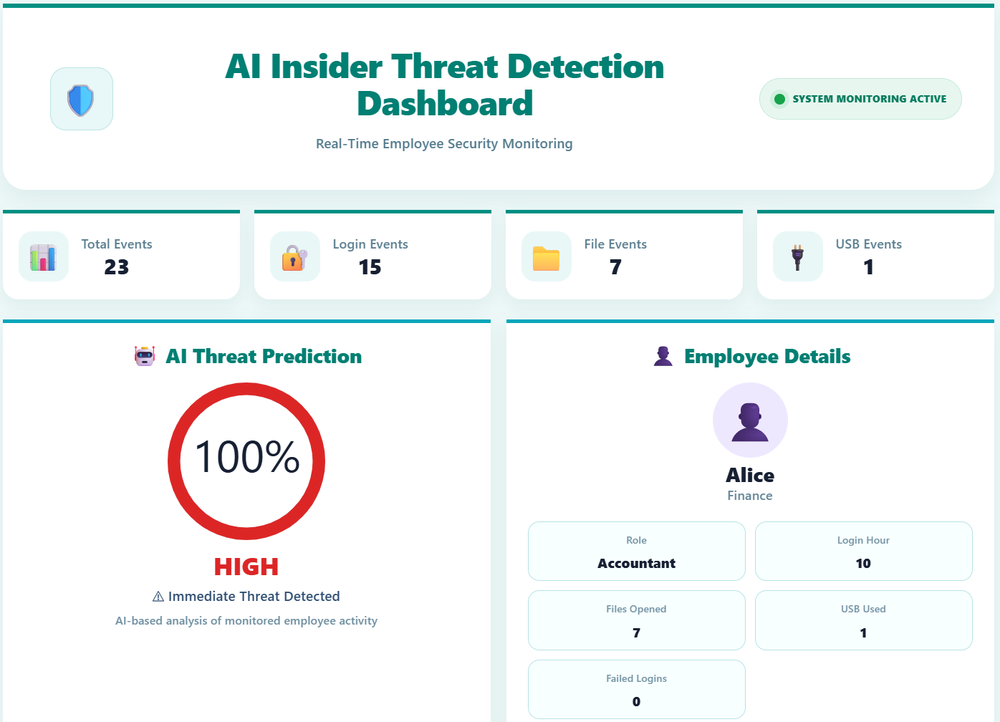
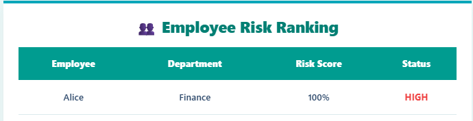
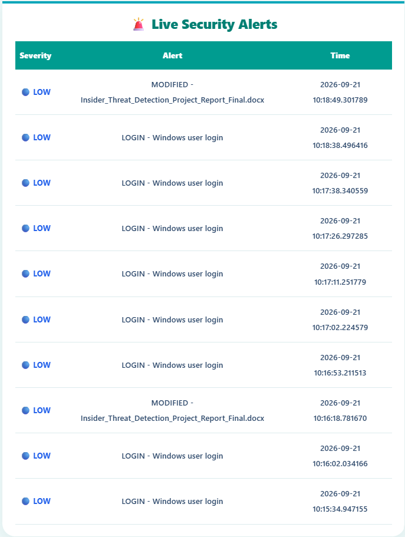
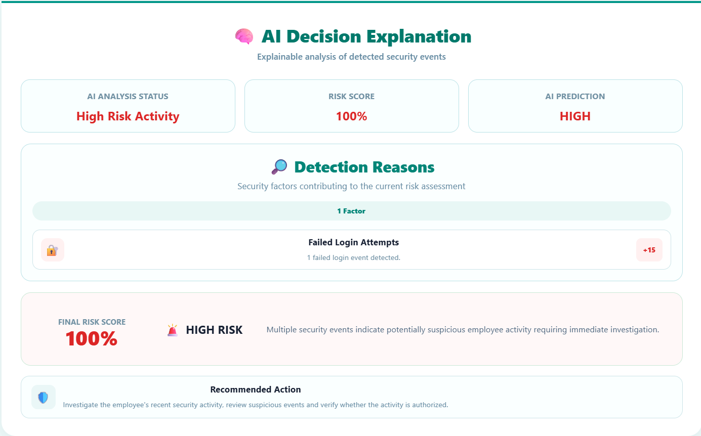

# AI-Powered Insider Threat Detection System

## Project Overview

The **AI-Powered Insider Threat Detection System** is a real-time security monitoring and risk analysis application designed to identify potentially suspicious employee activities.

The system monitors selected system events, analyzes activity patterns, assigns risk scores, and displays security alerts through an interactive dashboard.

## Key Features

* **File Activity Monitoring:** Tracks selected file system activities.
* **USB Monitoring:** Detects USB device connection and disconnection events.
* **Login Monitoring:** Monitors Windows security login events.
* **Risk Score Calculation:** Assigns risk scores based on detected activities.
* **AI-Based Risk Analysis:** Includes an Isolation Forest model for anomaly detection.
* **Real-Time Dashboard:** Displays activities, alerts, risk rankings, and employee status.
* **AI Decision Explanation:** Presents reasons contributing to the detected risk level.

## Technologies Used

| Component             | Technology                                 |
| --------------------- | ------------------------------------------ |
| Frontend              | React.js, Vite                             |
| Backend               | Python, FastAPI                            |
| AI / Machine Learning | Scikit-learn, Isolation Forest             |
| Database              | SQL                                        |
| System Monitoring     | Watchdog, WMI, Windows Security Event Logs |

## Project Structure

```text
AI-Insider-Threat-Detection/
├── ai_engine/
├── backend/
├── database/
├── frontend/
├── models/
├── monitoring/
├── scripts/
├── requirements.txt
└── README.md
```

## Installation and Setup

### 1. Clone the Repository

```bash
git clone https://github.com/balajabamani/AI-Insider-Threat-Detection.git
cd AI-Insider-Threat-Detection
```

### 2. Set Up the Backend

Open a terminal:

```powershell
cd backend
python -m venv .venv
.\.venv\Scripts\Activate.ps1
pip install -r requirements.txt
```

Start the backend:

```powershell
uvicorn app.main:app --reload
```

Backend API: http://127.0.0.1:8000
API Documentation: http://127.0.0.1:8000/docs

### 3. Set Up the Frontend

Open a second terminal from the project root:

```powershell
cd frontend
npm install
npm run dev
```

Open the local dashboard URL displayed in the terminal, usually:

http://localhost:5173

## System Requirements

* Windows operating system
* Python 3.x
* Node.js and npm
* Visual Studio Code (recommended)

Some monitoring features may require administrator privileges. Windows Security Event Log access depends on system permissions and configuration.

## Limitations

* Risk scores indicate potentially suspicious activity and do not prove malicious intent.
* USB monitoring detects device connection events but does not independently establish file-transfer attribution.
* Login-event capture and system-wide monitoring depend on Windows configuration, permissions, and validation.
* The current employee-risk dashboard may use configured employee data rather than automatic multi-employee discovery.

## Dashboard Screenshots

### Main Dashboard


### Employee Risk Ranking


### Live Security Alerts


### AI Decision Explanation


## Disclaimer

This project is developed for educational and cybersecurity research purposes. Monitoring should be performed only on systems for which proper authorization has been obtained.

## Author

**Balajabamani D**
M.Sc. Artificial Intelligence & Cyber Security
